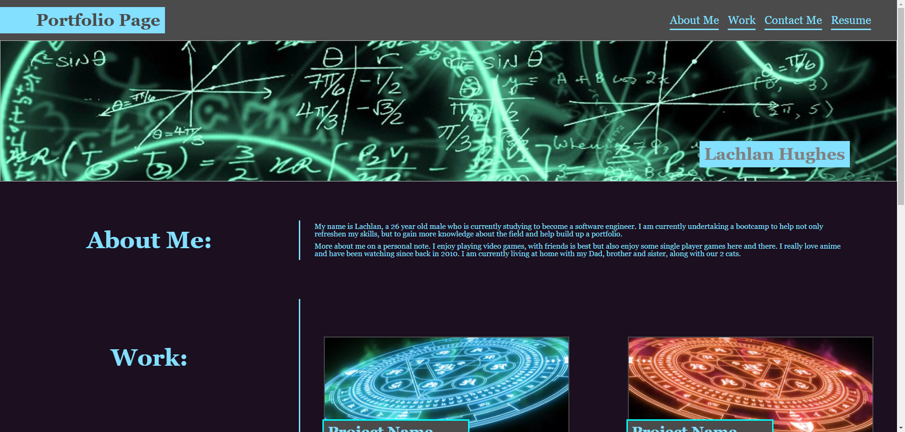
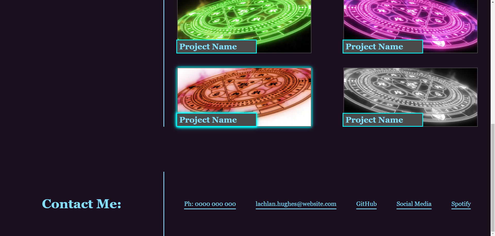

# Portfolio-page

This is my WIP portfolio page, here you will be able to access things such as different projects I've made, a bit of personal info about myself and contacts like my phone number, social media and much more.

[Click Here](https://CinosMagician.github.io/Portfolio-page) to view the live webpage

## Disclaimer

This webpage is still a work in progress, and as such, certain elements have been left as default or placeholder. Projects will be updated later to have a corresponding image and project name will be replaced with an appropreate name.

Besides the GitHub link, none of the contact info is correct and will not take you anywhere as of this stage. These will also be updated in the future.

## Known Issues

<li> when viewing on iPhone 15 Pro Max in Safari, screen elements do not seem to scale as indented, this is not the same case when tested on iPhone 11. This error does not occur when viewing in the Chrome app on iPhone 15 Pro Max.

## Usage

Below are some images for the webpage:

Here is the highlight effect when hovering a project:

## License

[MIT](https://choosealicense.com/licenses/mit/)
